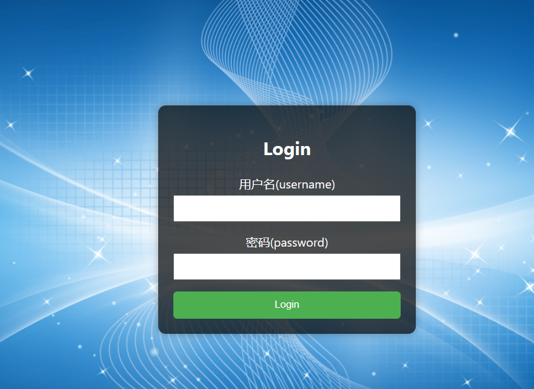

电商业务，克隆下来可以正常运行，目前用的.NET6
包含redis缓存，
消息中间件kafka、rabbitmq,
数据库使用mysql、sqlserver
可以单独使用使用dapper
ElasticSearch
微服务之间调用grpc，http，orleans，示例代码JwtAuthApp.Server、Login.Client
重点:
调用外部第三方服务可以用http请求，restshar库，
服务之间的调用用grpc,核心服务最好交给orleans。
orleans分布式高并发负载等特点，用作核心服务，比如订单处理，交易中心。
推送websocket
Common.Util组件是工具类，有es和其他的组件使用,后期可以把redishelper和其他的helper都移进来。
ConsumerClient 是简单的消息中间件的消费客户端示例
project是webapi，示例项目。
关于使用es和sqlserver做数据实时同步,为了es查询的文档参考以前写的
https://www.cnblogs.com/morec/p/17054383.html
或者自己查询其他的文档，mysql或者其他存储介质，其他数据之间同步蛮多的。

温馨提示:前端展示仅仅只是配合后端操作，没有花费任何时间做UI
温馨提示:有些非重点展示业务没有添加全部功能，比如注册，只是通过swagger接口创建用户而已

登录:

提前注册账号:admin 123456

商品列表:
第一次加载请求接口,后续每秒钟websocket实时推送最新数据

进入详情，下单后:

购买列表

后续:

付款，发货...
完善：es商品查询